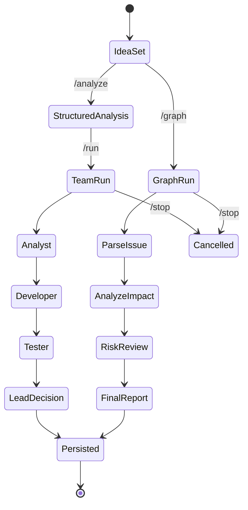

# LocalAgentProjectTeamOrchestration

Yerel modellerle calisan console tabanli bir agentic engineering uygulamasi. Proje, `project-lead`, `project-analyst`, `project-developer` ve `project-tester` skill rollerini konusturur; ayni zamanda 12 haftalik agent/tool/orchestration konularini tek bir mini capstone icinde pekistirir.

## Kurulum

Gerekli yerel modeller:

```text
qwen3-coder:30b
gemma3:12b
qwen3.6:latest
```

Ollama varsayilan adresi:

```text
http://localhost:11434
```

Derleme:

```powershell
dotnet build LocalAgentProjectTeamOrchestration.slnx
```

Calistirma:

```powershell
dotnet run --project LocalAgentProjectTeamOrchestration.Console
```

## Komutlar

```text
/idea Bir issue analyzer + local model orchestration araci yapalim
/analyze
/run
/graph
/tools
/outputs
/state
/history
/eval
/stop
/reset
/exit
```

- `/idea <metin>` aktif proje fikrini kaydeder.
- `/analyze` structured `TaskAnalysis` uretir ve JSON olarak gosterir.
- `/run` Lead -> Analyst -> Developer -> Tester -> Lead ekip konusmasini baslatir.
- `/graph` ParseIssue -> AnalyzeImpact -> RiskReview -> FinalReport akisini calistirir.
- `/tools` tool registry ve permission matrix'i gosterir.
- `/outputs` analiz, yazilimci, testci, lider ve uretilen proje klasorlerini gosterir.
- `/state` kalici session JSON state'ini gosterir.
- `/history` son konusma gecmisini gosterir.
- `/eval` 20 gorevlik golden task set icin basit evaluation calistirir.
- `/stop` aktif `/run` veya `/graph` isini iptal eder.
- `/reset` aktif state'i silmeden arsivler ve yeni oturum baslatir.

## Kalici Veri ve Loglar

Uygulama her seferinde sifirdan baslamaz. Acilista yerel dosyalardan kaldigi yeri okur.

```text
data/session-state.json
data/memory.md
data/archive/session-state-<timestamp>.json
logs/conversation-yyyyMMdd-HHmmss.md
logs/traces-yyyyMMdd.jsonl
```

`session-state.json` aktif oturumun makine tarafindan okunabilir halidir. Son fikir, phase, son agent ciktilari, graph state ve recent context burada tutulur.

`memory.md` insan tarafindan okunabilir uzun omurlu hafizadir. Kullanici tercihleri, kararlar, acik sorular ve sonraki adimlar buraya eklenir.

`conversation-*.md` konusmalari okunabilir Markdown olarak saklar.

`traces-*.jsonl` observability kayitlarini tutar: `AgentRun`, `AgentStep`, `ToolCallTrace`, hata ve guardrail sonuclari.

## Outputs Klasoru

Agent ekibinin urettigi isler `outputs` altinda ayrilir:

```text
outputs/analysis    Analist gereksinim dokumanlari
outputs/developer   Yazilimci implementasyon planlari
outputs/tester      Test planlari ve risk kontrolleri
outputs/lead        Lider karar ve sonraki adim dokumanlari
outputs/project     Yazilimcinin urettigi proje kodlari
```

Her rol yaniti hem `latest.md` olarak hem de zaman damgali Markdown dosyasi olarak yazilir.

Yazilimci gercek kod uretmek isterse yanitinda su formatla dosya bloklari verebilir:

````markdown
```file:src/MyGeneratedProject/Program.cs
Console.WriteLine("Hello from generated project");
```
````

Bu bloklar guvenli sekilde `outputs/project/src/MyGeneratedProject/Program.cs` altina yazilir. Mutlak path veya `..` iceren path'ler kabul edilmez.

## 12 Haftalik Konular Nerede?

| Hafta | Konu | Bu projedeki karsiligi |
| --- | --- | --- |
| 1 | Agent, tool, structured output | `TaskAnalysis` modeli ve `/analyze` komutu |
| 2 | Tool calling | `ReadFile`, `SearchCode`, `RunTests` ve `ToolRegistry` |
| 3 | Handoff ve role separation | Lead kontrollu Analyst -> Developer -> Tester akisi |
| 4 | State, memory, context | `SessionState`, `IssueAnalysisState`, `memory.md`, recent messages |
| 5 | Graph-based agent | `/graph` ile ParseIssue -> AnalyzeImpact -> RiskReview -> FinalReport |
| 6 | Tool permissioning | `ReadOnly`, `Execute`, `Write`, `Dangerous` permission matrix |
| 7 | MCP temel mimari | `ToolServer` abstraction ve tool discovery fikri |
| 8 | MCP guvenligi | Path allowlist, secret blocklist, command whitelist |
| 9 | Guardrails | Input, output, tool ve prompt budget guardrail'leri |
| 10 | Observability | `AgentRun`, `AgentStep`, `ToolCallTrace` JSONL kayitlari |
| 11 | Evaluation | `Evaluation/golden-tasks.json` ve `/eval` |
| 12 | Mini capstone | Issue analyzer + tools + guardrails + trace + evaluation birlesimi |

## Ornek TaskAnalysis

```json
{
  "taskType": "IssueAnalysis",
  "goal": "Bir issue analyzer yapalim",
  "inputs": ["user idea", "project skills", "persistent memory"],
  "constraints": ["local models", "console application", "JSON/Markdown persistence"],
  "requiredTools": ["ReadFile", "SearchCode", "RunTests"],
  "risks": ["Ollama may be offline", "requirements may be ambiguous"],
  "acceptanceCriteria": ["TaskAnalysis JSON is valid", "state file is updated"],
  "estimatedDifficulty": 3
}
```

## Tool Registry ve Permission Matrix

```text
ReadFile   ReadOnly  Allowed paths disina cikmadan dosya okur.
SearchCode ReadOnly  Cozum klasorunde dosya adi ve metin arar.
RunTests   Execute   Whitelist edilen komutlari mock olarak kabul eder.
Write      Write     Ilk surumde demo matrix seviyesinde tutulur.
Dangerous  Dangerous Ilk surumde calistirilmaz.
```

## State Transition Diagram



## Nasil Calisir?

1. Uygulama acilista `data/session-state.json` ve `data/memory.md` dosyalarini yukler.
2. `/idea` ile kullanici fikri state'e yazilir.
3. `/analyze` JSON structured output uretir.
4. `/run` skill dosyalarindan system prompt olusturur ve Ollama'daki yerel modelleri cagirir.
5. Her agent yanitindan sonra state, memory, conversation log, trace ve role output dosyalari guncellenir.
6. Developer yanitindaki `file:` kod bloklari `outputs/project` altina yazilir.
7. Uygulama kapatilip acildiginda `/state` ve `/history` kaldigi baglami gosterir.

## Model Eslesmeleri

```text
Lead      qwen3.6:latest
Analyst   qwen3.6:latest
Developer qwen3-coder:30b
Tester    gemma3:12b
```

Bu eslesmeler `LocalAgentProjectTeamOrchestration.Console/appsettings.json` icinde degistirilebilir.
